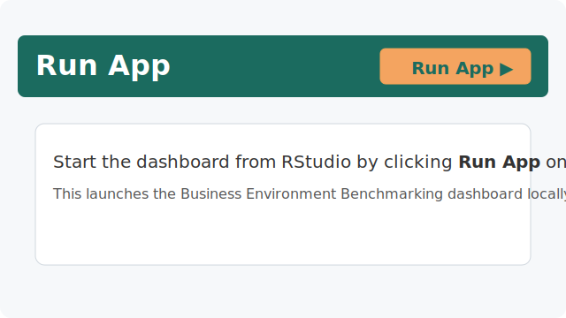

# World Bank Enterprise Surveys Dashboard

## Business Environment Benchmarking


Enterprise-grade Shiny dashboard for analyzing and benchmarking business environments across 168 economies using World Bank Enterprise Survey data.

**Developed by [Kwiz Computing Technologies](https://kwizresearch.com)** | Nairobi, Kenya

---

## 🎯 Features

### Analytics Modules

| Module | Description |
|--------|-------------|
| **Overview** | Global KPIs, interactive map, regional comparisons |
| **Country Profile** | Deep-dive analysis with radar charts and time series |
| **Cross-Country Benchmark** | Compare up to 10 countries across indicators |
| **Infrastructure** | Power outages, generator usage, productivity impact |
| **Access to Finance** | Credit gaps, collateral analysis, gender disparities |
| **Data Quality** | Complete transparency on data issues and filter logic |

### Technical Highlights

- ✅ **Rhino Framework** - Enterprise-grade modular architecture
- ✅ **World Bank API** - Real-time data from Enterprise Surveys API
- ✅ **Comprehensive Testing** - testthat unit tests with e2e coverage
- ✅ **Data Quality Documentation** - Full transparency on filtering logic
- ✅ **Responsive Design** - Works on desktop, tablet, and mobile
- ✅ **Reproducible Analysis** - R code provided for all transformations

---

## 📁 Project Structure

```
WBES-dashboard/
├── app
│   ├── logic
│   │   ├── __init__.R
│   │   ├── data_loader.R
│   │   ├── quality_assessor.R
│   │   └── wbes_data.R
│   ├── static
│   │   └── images/
│   ├── styles
│   │   └── main.scss
│   ├── view
│   │   ├── __init__.R
│   │   ├── mod_about.R
│   │   ├── mod_benchmark.R
│   │   ├── mod_corruption.R
│   │   ├── mod_country_profile.R
│   │   ├── mod_crime.R
│   │   ├── mod_custom_analysis.R
│   │   ├── mod_data_quality.R
│   │   ├── mod_finance_access.R
│   │   ├── mod_infrastructure.R
│   │   ├── mod_overview.R
│   │   ├── mod_performance.R
│   │   └── mod_workforce.R
│   └── main.R
├── data                     # Place WBES .dta or .csv files here
├── tests
│   ├── cypress
│   │   └── e2e
│   │       └── app.cy.js
│   └── testthat
│       └── test-main.R
├── app.R
├── dependencies.R
├── renv.lock
├── rhino.yml
└── README.md
```

---

## 🚀 Quick Start

### Prerequisites

```r
# Install required packages
install.packages(c(
  "rhino", "shiny", "bslib", "plotly", "leaflet", "DT",
  "dplyr", "tidyr", "haven", "readr", "purrr", "stringr",
  "httr", "jsonlite", "waiter", "logger", "box"
))
```

### Run Locally

```r
# Clone or download the project
# Navigate to the project directory

# Option 1: Using Rhino
rhino::app()

# Option 2: Using shiny directly
shiny::runApp()
```



### With renv (Recommended)

```r
# Restore exact package versions
renv::restore()

# Run app
rhino::app()
```

---

## 📊 Data Sources

### 1. World Bank API (Default)

The dashboard fetches aggregate indicators from the World Bank API (Source ID 13: Enterprise Surveys). No registration required.

```r
# Fetched indicators include:
# IC.FRM.OUTG.ZS - Power outages obstacle
# IC.FRM.FINA.ZS - Access to finance obstacle
# IC.FRM.CORR.ZS - Corruption obstacle
# ... and more
```

### 2. Microdata (Optional)

For firm-level analysis, download microdata from [enterprisesurveys.org](https://www.enterprisesurveys.org/en/survey-datasets):

1. Register (free) at the Enterprise Surveys portal
2. Download `.dta` or `.csv` files for your countries of interest
3. Place files in the `data/` directory
4. Restart the application

---

## 🔬 Testing

```r
# Run all tests
testthat::test_dir("tests/testthat")

# With Rhino
rhino::test_r()

# E2E tests (requires Cypress)
rhino::test_e2e()

# Check code style
rhino::lint_r()
```

---

## 📦 Deployment

### shinyapps.io

```r
# Install rsconnect if needed
install.packages("rsconnect")

# Configure your account
rsconnect::setAccountInfo(
  name = "YOUR_ACCOUNT",
  token = "YOUR_TOKEN",
  secret = "YOUR_SECRET"
)

# Deploy
rsconnect::deployApp(
  appFiles = c("app.R", "app/", "dependencies.R", "rhino.yml", "renv.lock"),
  appName = "wbes-dashboard"
)
```

### Posit Connect

```r
rsconnect::deployApp(
  appDir = ".",
  appName = "wbes-dashboard",
  server = "your-connect-server.com"
)
```

### Docker

```dockerfile
FROM rocker/shiny-verse:4.3.0

RUN R -e "install.packages(c('rhino', 'bslib', 'plotly', 'leaflet', 'DT', 'dplyr', 'tidyr', 'haven', 'readr', 'purrr', 'stringr', 'waiter', 'logger', 'httr', 'jsonlite', 'box'))"

COPY . /srv/shiny-server/wbes-dashboard

EXPOSE 3838
CMD ["/usr/bin/shiny-server"]
```

---

## 🎨 Theme Customization

Edit `app/styles/main.scss`:

```scss
$primary-teal: #1B6B5F;      // Main brand color
$secondary-coral: #F49B7A;    // Accent color
```

---

## 📖 Data Quality Philosophy

This dashboard follows the data quality principles outlined in the [Kwiz Research Blog](https://kwizresearch.com/blog):

1. **Transparency** - All data issues are documented
2. **Reproducibility** - R code provided for all filters
3. **Traceability** - Issues linked to specific indicators
4. **Severity Classification** - Clear risk indicators

See the **Data Quality** tab in the dashboard for complete documentation.

---

## 📄 License & Citation

### Data Citation

```
World Bank Group. Enterprise Surveys.
Available at: https://www.enterprisesurveys.org
```

### Dashboard Citation

```
Kwiz Computing Technologies (2025).
Business Environment Benchmarking Dashboard.
https://kwizresearch.com
```

---

## 🤝 Contact

**Kwiz Computing Technologies**

- 🌐 Website: [kwizresearch.com](https://kwizresearch.com)
- 📧 Email: jeankwizera@kwizresearch.com
- 💼 LinkedIn: [Jean Victor Kwizera](https://linkedin.com/in/jean-victor-kwizera)

For custom development, consultancy, or enterprise licensing inquiries, please contact us.

---

## 🙏 Acknowledgments

- [World Bank Enterprise Surveys](https://www.enterprisesurveys.org) for making data publicly available
- [Appsilon](https://appsilon.com) for the Rhino framework
- [Posit](https://posit.co) for the R ecosystem

*Built with ❤️ in Nairobi, Kenya*
